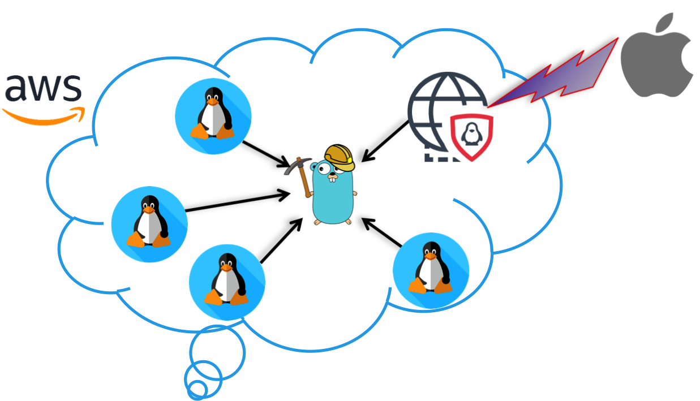

# Blockchain Application for Electronic Voting

<p align="center">

</p>

Repository for Final Year Project - Blockchain Application for Electronic Voting.

## Introduction

Governments, for the sake of innovation, transparency and citizen participation are interested in pilot voting projects based on blockchain technology. This innovative technology allows the decentralization of the government of operations, specifically the voting of citizens in an immutable, auditable, safe and reliable distributed registry.   

## Architecture
There are a few different aspects to developing blockchain applications with Ethereum:

1. Smart contract development - writing code that gets deployed to the blockchain with the Solidity programming language.  
2. Developing websites or clients that interact with the blockchain - writing code that reads and writes data from the blockchain with smart contracts.  
Web3.js enables you to fulfill the second responsibility: developing clients that interact with The Ethereum Blockchain. It is a collection of libraries that allow you to perform actions like send Ether from one account to another, read and write data from smart contracts and create smart contracts.  

If you have a web development background, you might have used jQuery to make Ajax calls to a web server. That's a good starting point for understanding the function of Web3.js. Instead of using a jQuery to read and write data from a web server, you can use Web3.js to read and write to The Ethereum Blockchain.  

Web3.js talks to The Ethereum Blockchain with JSON RPC, which stands for "Remote Procedure Call" protocol. Ethereum is a peer-to-peer network of nodes that stores a copy of all the data and code on the blockchain. Web3.js allows us to make requests to an individual Ethereum node with JSON RPC in order to read and write data to the network. It's kind of like using jQuery with a JSON API to read and write data with a web server.  


<p align="center">

</p>

The project is structured as follows:  
* A private blockchain network in AWS consisting in:
    * One miner
    * Five nodes
    * One NAT gateway
    * One external node

<p align="center">

</p>


## Demonstration
[](https://youtu.be/FBV_NhrNXes)

## Deployment
### Environment Setup
#### Step 1: Launch two EC2 instances.
Use t2.medium (2 vCPU, 4 GB RAM) with default 8G SSD. Pick Ubuntu OS. Make sure that the two nodes are with the same security group, which allows TCP 30303 (or 30000-30999 as I may use more ports on this range). Port 30303 by default is for peering among nodes.

<p align="center">

</p>

__Experience Sharing__   
I first tried t2.micro as it is the free-tier offer. However, mining was not successful (“DAG” loop without ether reward). I next tried t2.small and mining worked. However, when I deployed contract (see Part 2), the rpc was unstable. Finally, I found t2.medium good enough for my setup.  

I usually STOP the instance after testing (to save money). Please note that the public IP address of the EC2 instance will be changed after you START it back. This does not have an impact on our setup here as I am using the private IP address of these instances for peering. Private IP address remains even after I STOP/START the instance. In any case if Public IP address is needed, the peering still works, but you may need to change the peering address every time.  

#### Step 2: Install geth client on Node 1
Access to Node 1 with ssh and proper key. Follow the recommended process (link) for geth installation. Install from PPA is good enough.

Node 1
```
$ sudo apt-get install software-properties-common
$ sudo add-apt-repository -y ppa:ethereum/ethereum
$ sudo apt-get update
$ sudo apt-get install ethereum
``` 

and verify it with $ which geth and you will see that geth is installed properly.

#### Step 3: Prepare the Genesis.json
This same Genesis.json is applied to both nodes, as it is to ensure both nodes having the same genesis block. Here is the Genesis.json I used, which is adopted from here (link). I take out the initial allocation as I don’t need to modify the address on this file in each new setup. Each account will gain some ethers once it starts mining.

```
Genesis.json
{

"config": {

"chainId": 15,

"homesteadBlock": 0,

"eip155Block": 0,

"eip158Block": 0

},

"nonce": "0x0000000000000042",

"mixhash": "0x0000000000000000000000000000000000000000000000000000000000000000",

"difficulty": "0x200",

"alloc": {},

"coinbase": "0x0000000000000000000000000000000000000000",

"timestamp": "0x00",

"parentHash": "0x0000000000000000000000000000000000000000000000000000000000000000",

"gasLimit": "0xffffffff",

"alloc": {

}

}
```
 
Keep this file somewhere and later scp to the nodes, or just copy and paste with an editor on both nodes.

#### Step 4: Init the geth with Genesis.json
Node 1	
```
$ geth init Genesis.json
```

#### Step 5: Launch geth now
It is good practice to have two screens in parallel (or a split terminal). One screen is the console while another shows the log. Open a new terminal and ssh to Node 1, and keep reading the log.

Node 1	
```
$ geth --nodiscover console 2>> eth.log
```
In another terminal
```
$ tail -F eth.log
```

<p align="center">

</p>

Two-Node Setup of a Private Ethereum on AWS with Contract Deployment  

__Experience Sharing__  
In many examples, it is recommended to use –datadir to specify the directory for private ethereum blockchain. This is good practice when you are interacting with different chains. My example is an isolated environment. Therefore I omit this option, and my private chain is stored in the directory ~/.ethereum/.

#### Step 6: Create an Account on Node 1
Node 1 geth
```
> personal.newAccount()

> eth.getBalance(eth.accounts[0])
```
Or
```
> web3.fromWei(eth.getBalance(eth.accounts[0]), “ether”)
```

Now we have an account on this node (always check it with `> eth.accounts[0]` or `> eth.coinbase`). And currently, there is no ether in the account balance as we have not allocated any in Genesis.json.  

#### Step 7: Start Mining
We can begin mining process.

1. From the log terminal, we will see “Generating DAG in progress” and after an epoch, a block is being mined.  
2. Once a block is mined, 5 ethers are added to the account balance. This is a good indicator whether mining is successful or not.  
3. If we keep mining, the amount of account balance keeps increasing as more new blocks are mined.  

Node 1 geth	
```
> miner.start()
> eth.getBalance(eth.accounts[0])
```
Feel free to keep mining, or we can turn it off by `> miner.stop()`.
Now Node 1 is ready. Let’s work on Node 2.  

#### Step 8: Repeat Step 2-6 on Node 2
Make sure the same Genesis.json is used when init the blockchain on Node 2.  
Do not start mining as we want Node 2 on the same blockchain as Node 1 (through Peering).  

#### Step 9: Peering
Now we begin peering the two nodes. There are several ways to peer. Here I am using “admin addPeer” to do the peering: in Node 2, add Node 1 enode information for peering.

First, check both nodes that there is no peering.
```
Node 1	> admin.peers
Node 2	> admin.peers
```

Obtain enode information from Node 1
```
Node 1	> admin.nodeInfo.enode
```
We will get something like this:
```
"enode://c667fdf1f6846af74ed14070ef9ffeee33e98ff8ab0dd43f67415868974d8205e0fb7f55f6f37e9e1ebb112adfc0b88755714c7bc83a7ac47d30f8eb53118687@[::]:30303?discport=0"
```
Add this information to Node 2. Change the [::] with the Private Address of Node 1.  
Node 2
```
> admin.addPeer("enode://c667fdf1f6846af74ed14070ef9ffeee33e98ff8ab0dd43f67415868974d8205e0fb7f55f6f37e9e1ebb112adfc0b88755714c7bc83a7ac47d30f8eb53118687@172.31.62.34:30303?discport=0")
```
After that check, both nodes and they are peering each other.
```
Node 1	> admin.peers
Node 2	> admin.peers
```

The left-hand-side is Node 1 and right-hand-side is Node 2. Note that after `> addPeer()` on Node 2, two nodes are peered. We do not need to do the same thing on Node 1.


Also, from the log, we see that, after peering, we see “Block synchronization started” and “Imported new chain segment” on Node 2 log (bottom-right terminal).

 

__Experience Sharing__  
Make sure to use the same Genesis.json to initiate the blockchain. In one trial I forgot to init step and peering was unsuccessful.  
AWS EC2 instance comes with a private IP address and a public IP address. Both works fine in add peering, but using private IP address is more convenient as it is not changed after instance STOP/START.

#### Step 10: Send Ethers Between Accounts
 
As both nodes are in the same Ethereum blockchain, we will send some ethers between the accounts. In this example, 10 ethers are sent from the account of Node 1 to account of Node 2. This is one of the best ways to verify if the setup is successful.  
Node 1
```
> web3.fromWei(eth.getBalance(eth.coinbase), “ether”)
> personal.unlockAccount(eth.coinbase)
> eth.sendTransaction({from: eth.coinbase, to: "0xabc65de992289401dcff3a70d4fcfe643f7d2271", value: web3.toWei(10, “ether”)})
> miner.start()
```
Node 2
```
> web3.fromWei(eth.getBalance(eth.coinbase), “ether”)
```

<p align="center">

</p>

Note that we see “pending transaction” as this transaction is not mined yet. Once we start mining in Node 1, the transaction is done and account balance on Node 2 is now 10 ethers.  

And we see 45 ethers in Node 1 (not the expected 20-10=10 ethers). It is because Node 1 keeps receiving mining reward (5 ethers per block). The balance will keep increasing until we stop mining.  

### Smart Contract Deployment
Now we deploy a contract on this blockchain, and the accounts of both nodes can access the contract and execute the functions.  
My plan is to deploy the contract on Node 1 and see how Node 2 accesses this contract.  

#### The Code "Voting.sol"
```
pragma solidity ^0.4.11;
// We have to specify what version of compiler this code will compile with

contract Voting {
  /* mapping field below is equivalent to an associative array or hash.
  The key of the mapping is candidate name stored as type bytes32 and value is
  an unsigned integer to store the vote count
  */
  
  mapping (bytes32 => uint8) public votesReceived;
  
  /* Solidity doesn't let you pass in an array of strings in the constructor (yet).
  We will use an array of bytes32 instead to store the list of candidates
  */
  
  bytes32[] public candidateList;

  /* This is the constructor which will be called once when you
  deploy the contract to the blockchain. When we deploy the contract,
  we will pass an array of candidates who will be contesting in the election
  */
  function Voting(bytes32[] candidateNames) {
    candidateList = candidateNames;
  }

  // This function returns the total votes a candidate has received so far
  function totalVotesFor(bytes32 candidate) returns (uint8) {
    if (validCandidate(candidate) == false) throw;
    return votesReceived[candidate];
  }

  // This function increments the vote count for the specified candidate. This
  // is equivalent to casting a vote
  function voteForCandidate(bytes32 candidate) {
    if (validCandidate(candidate) == false) throw;
    votesReceived[candidate] += 1;
  }

  function validCandidate(bytes32 candidate) returns (bool) {
    for(uint i = 0; i < candidateList.length; i++) {
      if (candidateList[i] == candidate) {
        return true;
      }
    }
    return false;
  }
}
```
This is a simple contract to illustrate how Solidity code works. Here are some points we will refer to in this part.  

The contract requires a list of candidates (see the constructor). We will input this when deploying a new contract. Two functions are defined in this contract: `totalVotesFor` and `voteForCandidate`. We will use these two functions to interact with the contract from both nodes.

#### Smart Contract Compilation
To compile the solidity code, we will first install npm module called solc. Then use the compiler to compile the contract  
```
mahesh@zastrin:~/ethereum_voting_dapp/chapter1$ npm install solc@0.5.3
mahesh@zastrin:~/ethereum_voting_dapp/chapter1$ node_modules/.bin/solcjs --bin --abi Voting.sol
mahesh@zastrin:~/ethereum_voting_dapp/chapter1$ ls
Voting.sol              Voting_sol_Voting.abi   Voting_sol_Voting.bin
```
When you compile the code successfully using the command above, the compiler outputs 2 files that are important to understand:  

* Voting_sol_Voting.bin: This is the bytecode you get when the source code in Voting.sol is compiled. This is the code which will be deployed to the blockchain.  
* Voting_sol_Voting.abi: This is an interface or template of the contract (called abi) which tells the contract user what methods are available in the contract. Whenever you have to interact with the contract in the future, you will need this abi definition.  

After compilation, we need two pieces of information for contract deployment. They are the Application Binary Interface (ABI) and Bytecode.

#### Application Binary Interface (ABI)
It contains the methods available in this contract that users can interact with. Here is the ABI for this Voting contract.
```
'[{"constant":false,"inputs":[{"name":"candidate","type":"bytes32"}],"name":"totalVotesFor","outputs":[{"name":"","type":"uint8"}],"payable":false,"type":"function"},{"constant":false,"inputs":[{"name":"candidate","type":"bytes32"}],"name":"validCandidate","outputs":[{"name":"","type":"bool"}],"payable":false,"type":"function"},{"constant":true,"inputs":[{"name":"","type":"bytes32"}],"name":"votesReceived","outputs":[{"name":"","type":"uint8"}],"payable":false,"type":"function"},{"constant":true,"inputs":[{"name":"","type":"uint256"}],"name":"candidateList","outputs":[{"name":"","type":"bytes32"}],"payable":false,"type":"function"},{"constant":false,"inputs":[{"name":"candidate","type":"bytes32"}],"name":"voteForCandidate","outputs":[],"payable":false,"type":"function"},{"inputs":[{"name":"candidateNames","type":"bytes32[]"}],"payable":false,"type":"constructor"}]'
```

#### Bytecode
It is the actual contract code to be deployed on the blockchain. Here is the bytecode.
```
'0x6060604052341561000c57fe5b6040516103d83803806103d8833981016040528080518201919050505b806001908051906020019061003f929190610047565b505b506100bf565b828054828255906000526020600020908101928215610089579160200282015b82811115610088578251829060001916905591602001919060010190610067565b5b509050610096919061009a565b5090565b6100bc91905b808211156100b85760008160009055506001016100a0565b5090565b90565b61030a806100ce6000396000f30060606040526000357c0100000000000000000000000000000000000000000000000000000000900463ffffffff1680632f265cf714610067578063392e6678146100a55780637021939f146100e1578063b13c744b1461011f578063cc9ab2671461015b575bfe5b341561006f57fe5b61008960048080356000191690602001909190505061017f565b604051808260ff1660ff16815260200191505060405180910390f35b34156100ad57fe5b6100c76004808035600019169060200190919050506101cd565b604051808215151515815260200191505060405180910390f35b34156100e957fe5b610103600480803560001916906020019091905050610233565b604051808260ff1660ff16815260200191505060405180910390f35b341561012757fe5b61013d6004808035906020019091905050610253565b60405180826000191660001916815260200191505060405180910390f35b341561016357fe5b61017d600480803560001916906020019091905050610278565b005b60006000151561018e836101cd565b1515141561019c5760006000fd5b60006000836000191660001916815260200190815260200160002060009054906101000a900460ff1690505b919050565b60006000600090505b6001805490508110156102285782600019166001828154811015156101f757fe5b906000526020600020900160005b505460001916141561021a576001915061022d565b5b80806001019150506101d6565b600091505b50919050565b60006020528060005260406000206000915054906101000a900460ff1681565b60018181548110151561026257fe5b906000526020600020900160005b915090505481565b60001515610285826101cd565b151514156102935760006000fd5b600160006000836000191660001916815260200190815260200160002060008282829054906101000a900460ff160192506101000a81548160ff021916908360ff1602179055505b505600a165627a7a72305820994b2ebbfeec46890216bc547cf9a1292547cc43f08440506866c34b2ff0ac9e0029'
```

#### Step 1: Install node.js and web3 on both nodes
The interaction to contract is through nodejs and web3js. We need to install nodejs and the web3 modules.  

Node 1
```
$ sudo apt-get install python-software-properties
$ curl -sL https://deb.nodesource.com/setup_6.x | sudo -E bash -
$ sudo apt-get install nodejs
```

To verify successful installation, use `$ node -v` and `$ npm -v`, and their version is shown.  
Then install web3 module.

Node 1
```
$ npm install web3
```
Repeat this step in Node 2 as well.  
 
#### Step 2: Access Blockchain through web3 in Node Console
We are ready to access the node. Since we need both geth client and node console, we will use split screen again. The top terminal is geth, and the bottom is node console.  

To start the geth, depending on whether you still have geth running, either command should bring you back to console.  
Node 1 (geth)
```
$ geth --nodiscover console 2>>eth.log OR
$ geth attach
```

To start the node console, simply use this
Node 1 (node)
```
$ node
```

<p align="center">

</p>

We are now ready to use node console to access geth by rpc. The default rpc is on http://localhost:8545/.
First, turn on rpc on geth:
Node 1 (geth)
```
> admin.startRPC()
```
On node console,
```
> Web3 = require(‘web3’)
> web3 = new Web3(new Web3.providers.HttpProvider(“http://localhost:8545”))
```

To verify if the node can reach geth successfully we can use > web3.eth.accounts on node console. We should see the account that we created on geth console.

<p align="center">

</p>

Repeat this step on Node 2.

### Step 3: Deploy Contract on Node 1
We now deploy the contract on this private blockchain from Node 1.
Node 1 (node)
```
> abi = <abi shown above>
> VotingContract = web3.eth.contract(JSON.parse(abi))
> byteCode = <bytecode shown above>
```
As the deployment requires gas, we need to unlock the account and turn on mining  
Node 1 (geth)
```
> personal.unlockAccount(eth.accounts[0])
> miner.start()
```

Now we deploy the contract. This contract requires a list of candidates. We will include this when deploying the contract.  
Node 1 (node)
```
> deployedContract = VotingContract.new(['Rama', 'Nick', 'Jose'], { data: byteCode, from: web3.eth.accounts[0], gas: 4700000 })
```
 
Now the contract is deployed. And we can execute the functions for verification. We will see the vote increasing when we keep executing the functions.

Node 1 (node)
```
> deployedContract.totalVoteFor.call('Rama')
> deployedContract.voteForCandidate('Rama', {from: web3.eth.accounts[0]})
```

<p align="center">

</p>

The contract is successfully deployed. Now we move to Node 2 and see how account in Node 2 can also access this contract.  

#### Step 4: Access Contract from Node 2
Make sure Node 1 and Node 2 have already peered. Verify by `> admin.peers` on geth console on both nodes.

The information required for an account in Node 2 accessing this deployed contract is (1) the ABI and (2) its deployed address. We have ABI information already. Now from Node 1 we can obtain this deployed address.  
Node 1 (node)
```
> deployedContract.address
'0x97a4b975c8fde24d8e40551054342c95676ed959'
```
For ABI, we define VotingContract with the same abi on Node 2.
Node 2 (node)
```
> abi = <abi shown above>
> VotingContract = web3.eth.contract(JSON.parse(abi))
```
We do not need to deploy a new contract as we did on Node 1. Instead, we define the contract instance based on the VotingContract and the address we obtained from Node 1.  
Node 2 (node)
```
> contractInstance = VotingContract.at('0x97a4b975c8fde24d8e40551054342c95676ed959')
```

Left-hand-side is Node 1, and right-hand-side is Node 2.

<p align="center">

</p>

Now, contract Instance is the point we can access this deployed contract in Node 2. We can issue the commands just as we do on Node 1:  
Node 2 (node)
```
> contractInstance.totalVoteFor.call('Rama')
> contractInstance.voteForCandidate('Rama', {from: web3.eth.accounts[0]})
```

Don’t forget to unlock the account on Node 2 when voting, as this consumes gas to execute a function on the contract.  

#### Step 5: Verification
By interacting on both nodes, we see accounts on both nodes are acting on the same contract. Here I capture the interaction between the two nodes.  

1. Both nodes see the same result (vote count for Rama is 4).  
2. An account on Node 1 votes for Rama once.  
3. From Node 2 we see the vote count for Rama is now 5.  
4. An account on Node 2 votes for Rama again.  
5. From Node 1 now we see the vote count is now 6.  

### Webpage to connect to the blockchain and vote
Now that most of the work is done, all we have to do now is create a simple html file with candidate names and invoke the voting commands (which we already tried and tested in the nodejs console) in a js file. Below you can find the html code and the js file. Drop both of them in the ethereum_voting_dapp/chapter1 directory and open the index.html in your browser.  
index.html 
```
<!DOCTYPE html>
<html>
<head>
 <title>Hello World DApp</title>
 <link href='https://fonts.googleapis.com/css?family=Open Sans:400,700' rel='stylesheet' type='text/css'>
 <link href='https://maxcdn.bootstrapcdn.com/bootstrap/3.3.7/css/bootstrap.min.css' rel='stylesheet' type='text/css'>
</head>
<body class="container">
 <h1>A Simple Hello World Voting Application</h1>
 <div class="table-responsive">
  <table class="table table-bordered">
   <thead>
    <tr>
     <th>Candidate</th>
     <th>Votes</th>
    </tr>
   </thead>
   <tbody>
    <tr>
     <td>Rama</td>
     <td id="candidate-1"></td>
    </tr>
    <tr>
     <td>Nick</td>
     <td id="candidate-2"></td>
    </tr>
    <tr>
     <td>Jose</td>
     <td id="candidate-3"></td>
    </tr>
   </tbody>
  </table>
 </div>
 <input type="text" id="candidate" />
 <a href="#" onclick="voteForCandidate()" class="btn btn-primary">Vote</a>
</body>
<script src="https://cdn.jsdelivr.net/gh/ethereum/web3.js@1.0.0-beta.37/dist/web3.min.js"></script>
<script src="https://code.jquery.com/jquery-3.1.1.slim.min.js"></script>
<script src="./index.js"></script>
</html>
```
index.js
```
web3 = new Web3(new Web3.providers.HttpProvider("http://localhost:8545"))
var account;
web3.eth.getAccounts().then((f) => {
 account = f[0];
})

abi = JSON.parse('[{"constant":true,"inputs":[{"name":"candidate","type":"bytes32"}],"name":"totalVotesFor","outputs":[{"name":"","type":"uint8"}],"payable":false,"stateMutability":"view","type":"function"},{"constant":true,"inputs":[{"name":"candidate","type":"bytes32"}],"name":"validCandidate","outputs":[{"name":"","type":"bool"}],"payable":false,"stateMutability":"view","type":"function"},{"constant":true,"inputs":[{"name":"","type":"bytes32"}],"name":"votesReceived","outputs":[{"name":"","type":"uint8"}],"payable":false,"stateMutability":"view","type":"function"},{"constant":true,"inputs":[{"name":"","type":"uint256"}],"name":"candidateList","outputs":[{"name":"","type":"bytes32"}],"payable":false,"stateMutability":"view","type":"function"},{"constant":false,"inputs":[{"name":"candidate","type":"bytes32"}],"name":"voteForCandidate","outputs":[],"payable":false,"stateMutability":"nonpayable","type":"function"},{"inputs":[{"name":"candidateNames","type":"bytes32[]"}],"payable":false,"stateMutability":"nonpayable","type":"constructor"}]')

contract = new web3.eth.Contract(abi);
contract.options.address = "0x71789831d83d4C8325b324eA9B5fFB27525480b5";
// update this contract address with your contract address

candidates = {"Rama": "candidate-1", "Nick": "candidate-2", "Jose": "candidate-3"}

function voteForCandidate(candidate) {
 candidateName = $("#candidate").val();
 console.log(candidateName);

 contract.methods.voteForCandidate(web3.utils.asciiToHex(candidateName)).send({from: account}).then((f) => {
  let div_id = candidates[candidateName];
  contract.methods.totalVotesFor(web3.utils.asciiToHex(candidateName)).call().then((f) => {
   $("#" + div_id).html(f);
  })
 })
}

$(document).ready(function() {
 candidateNames = Object.keys(candidates);

 for(var i=0; i<candidateNames.length; i++) {
 let name = candidateNames[i];
  
 contract.methods.totalVotesFor(web3.utils.asciiToHex(name)).call().then((f) => {
  $("#" + candidates[name]).html(f);
 })
 }
});
```
If you remember, we said earlier we will need the abi and the address to interact with any contract. You can see above in the index.js file how they are used to interact with the contract.  

Open the index.html in your browser and you should see something like this.
<p align="center">

</p>

If you are able to enter the candidate name in the text box and vote and see the vote count increment, the voting application has been successfully deployed.

## Technologies Used

* Ethereum (geth client)
* Solidity
* Web3js
* Nodejs
* Linux
* HTML5, CSS3 and JavaScript

## Author

* **Javier Mantilla**

## License

This project is licensed under the MIT License - see the [LICENSE](LICENSE) file for details

## Acknowledgments

* Daniel Cregg 